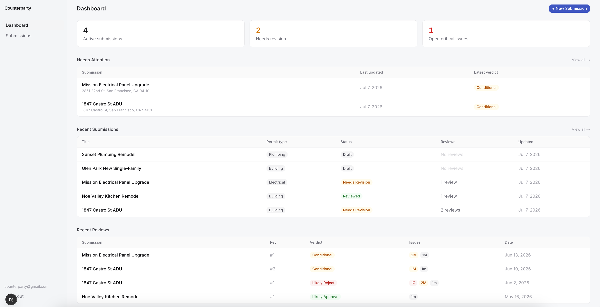
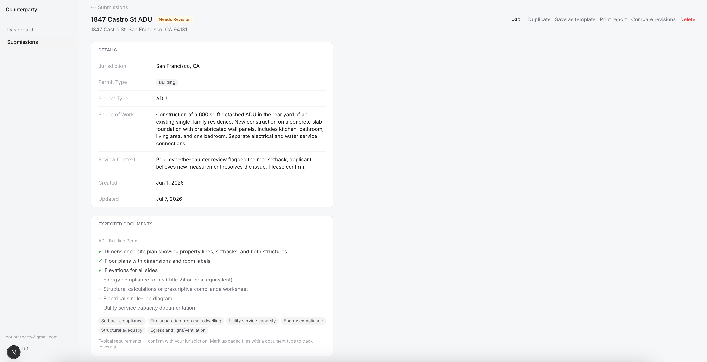
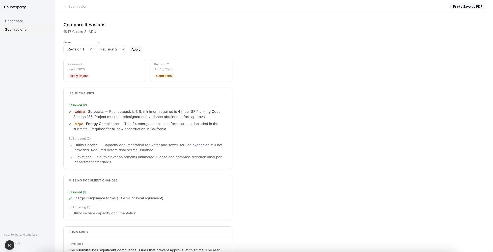
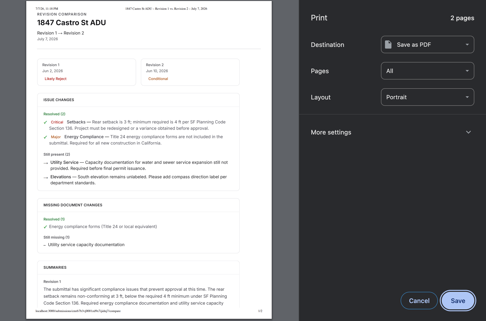

# Counterparty

Permit review workflow simulator for residential construction and renovation.

## Demo Video

Watch the short walkthrough: [Counterparty Demo](https://youtu.be/-JJuIGjXw1Y)

## Screenshots

### Dashboard



### Review Detail



### Revision Compare



### Printable Report



## Overview

Getting a residential permit approved is opaque. Most homeowners and small contractors do not know what plan checkers look for, and first submissions routinely get rejected for missing documents, non-compliant scope descriptions, or code violations. Counterparty lets you pressure-test a permit application before you show up at city hall.

Users describe their project, attach relevant documents, and request a review. Claude plays the role of a residential plan checker for the given jurisdiction, returning a structured verdict, a written summary, a list of specific issues with severity ratings and code references, and a list of missing documents. Users can revise their submission and request additional reviews to track their progress across revisions.

Counterparty is built for homeowners planning a renovation or addition, and small residential contractors who manage permit applications on behalf of clients.

## Features

- Create permit submissions with title, address, jurisdiction, permit type, project type, scope of work, and optional reviewer context
- Upload and label documents and plan sets as artifacts attached to a submission
- Request an AI review powered by Claude, acting as a residential plan checker for the specified jurisdiction
- Receive a structured verdict (Likely Approve, Conditional, or Likely Reject), a written summary, flagged issues, and a list of missing documents
- Track issues by severity (Critical, Major, Minor) and category, with optional code citations
- Build a full revision history across multiple review requests for the same submission
- Compare any two review revisions side by side to see which issues were resolved and what changed
- Generate a printable report for any review revision
- Save reusable submission templates to pre-fill the new submission form for common project types
- Dashboard with active submission counts, needs-revision items, critical issue counts, recent submissions, and recent reviews

## Tech Stack

| Layer | Technology | Purpose |
|---|---|---|
| Framework | Next.js 16 (App Router) | Full-stack React with server components and server actions |
| Language | TypeScript | End-to-end type safety |
| UI | Tailwind CSS + shadcn primitives | Utility-first styling with accessible component base |
| Auth | Supabase Auth | Session management via JWT and cookie middleware |
| Database | Supabase Postgres | Relational storage for submissions, reviews, artifacts, and templates |
| ORM | Prisma | Type-safe DB access with migration support |
| AI | Anthropic Claude | Structured permit review output with zero-temperature JSON responses |
| Hosting | Vercel | Zero-config Next.js deployment |

## Local Setup

### Prerequisites

- Node.js 20 or later
- A Supabase project (free tier works)
- An Anthropic API key

### Install

```bash
git clone <repo-url>
cd counterparty
npm install
```

### Environment Variables

Create a `.env.local` file in the project root with the following variables:

```bash
# Supabase
DATABASE_URL=your_supabase_pooled_connection_string
DIRECT_URL=your_supabase_direct_connection_string
NEXT_PUBLIC_SUPABASE_URL=https://your-project.supabase.co
NEXT_PUBLIC_SUPABASE_PUBLISHABLE_KEY=your_supabase_publishable_key

# Anthropic
ANTHROPIC_API_KEY=your_anthropic_api_key
```

Optional variables:

```bash
# Override the Claude model used for reviews (defaults to claude-sonnet-4-6)
REVIEW_MODEL=claude-sonnet-4-6

# Set to "true" to skip Anthropic API calls and return mock review data
MOCK_REVIEWER=true
```

`DATABASE_URL` and `DIRECT_URL` are both available in your Supabase project under Settings > Database > Connection string. Use the pooled connection string for `DATABASE_URL` and the direct connection string for `DIRECT_URL`.

### Database Setup

Apply the Prisma migrations to your Supabase database:

```bash
npx prisma migrate deploy
```

### Run the App

```bash
npm run dev
```

The app runs at `http://localhost:3000`. Sign up for an account and log in. The app will automatically create a workspace for your account on first login.

## Demo Data

The repo includes a seed script that creates a realistic demo dataset so you can explore every surface of the app without manually creating submissions.

**Before running the seed, log in to the app at least once.** The seed script looks up the local workspace that was bootstrapped at login. If no workspace exists, the script will exit with an error.

Once logged in, run:

```bash
npm run db:seed
```

The seed creates:

- 5 demo submissions across a range of permit types, project types, and statuses (Draft, Needs Revision, Reviewed)
- 3 submission templates pre-loaded for common project types
- 8 artifacts attached to submissions as representative plan sets
- 4 AI reviews with a full set of issues, missing documents, and verdicts
- Revision history on the ADU submission (2 revisions) to support the compare page and report page

The seed is idempotent. Running it again after a full seed will print "Demo data already seeded" and exit. If a previous run was interrupted, the script will clean up the partial data and reseed from scratch. Existing non-demo submissions and data in your workspace are not affected.

## Demo Walkthrough

This walkthrough uses the data created by `npm run db:seed`.

**1. Dashboard**

Open the dashboard at `/dashboard`. The stat cards show the number of active submissions, submissions needing revision, and open critical issues. The "Needs Attention" table lists submissions with outstanding issues. Recent submissions and recent reviews are shown below.

**2. Submissions list**

Navigate to Submissions. All 5 demo submissions are listed with their permit type, status badge, review count, and last-updated date. Use the search and sort controls to filter.

**3. Submission detail: 1847 Castro St ADU**

Click "1847 Castro St ADU". This submission has two review revisions. The detail page shows the full scope of work, attached artifacts with document labels, the review history, and the full issue list from the most recent review. The verdict progressed from Likely Reject (Rev 1) to Conditional (Rev 2) as issues were resolved.

**4. Compare revisions**

From the submission detail page, click "Compare" on any review. The compare page shows a side-by-side diff of two review revisions: which issues were resolved, which remain, and which are new. This is the primary tool for tracking progress across revision cycles.

**5. Printable report**

From the submission detail page, click "Report" on any review. The report page renders a formatted summary suitable for printing or saving as a PDF. Use the Print button to export it.

**6. Templates**

Navigate to Templates. Three pre-loaded templates are available: Standard ADU, Kitchen/Bath Remodel, and Electrical Panel Upgrade. Click "Use template" on any template to pre-fill the new submission form with reusable scope of work language, jurisdiction, permit type, and project type.

**7. New submission**

Click "New Submission" from the dashboard or submissions list. Select a template or fill in the fields manually. After creating the submission, attach any documents as artifacts with labels, then request a review from the detail page.

## Limitations

- Counterparty is a permit review workflow prototype and is not connected to any real permitting authority or filing system.
- AI review findings and code citations are intended as review assistance. They should be verified against the applicable code before use in a real permit submission. Code references are best-effort and should be verified against current local requirements before use in a real submission.
- Document uploads attach file metadata to the submission and provide document labels to the AI reviewer. They do not perform OCR or extract content from the uploaded files.
- Jurisdiction rules and local code requirements are not backed by a maintained municipal code database. The AI reasons from training knowledge about the stated jurisdiction.
- The app is scoped to a single user per workspace in its current form. Multi-user and team workspace features are planned for a future version.

## Roadmap

Selected improvements planned for future versions:

- OCR and full-text extraction from uploaded documents so the AI can review actual plan content
- Jurisdiction database with pre-loaded local requirements by city and county
- Code book references linked to actual published code sections
- Multi-user workspace access for permit expediters and small teams
- Submission export as a formatted PDF cover letter for use with the real application packet

## Internal Docs

- [Technical Writeup](docs/TECHNICAL_WRITEUP.md): current implementation reference
- [Demo Script](docs/DEMO_SCRIPT.md): walkthrough guide for recording or live demos
- [Product Requirements](docs/PRD.md)
- [Architecture](docs/ARCHITECTURE.md): historical planning document; may not reflect the current implementation
- [Tasks](docs/TASKS.md)
